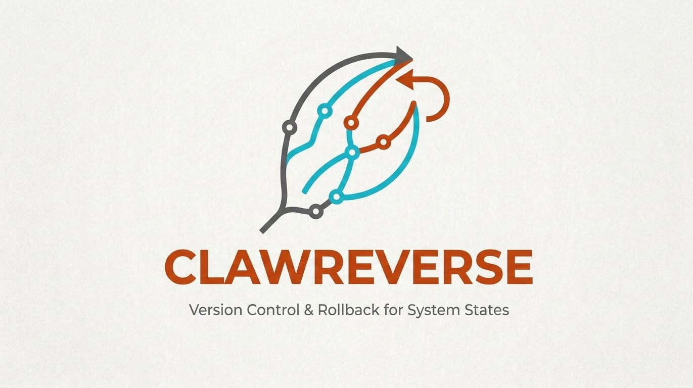

<p align="center">
  
</p>


# ClawReverse

[English](README.md) | 简体中文

为 OpenClaw 会话提供检查点暂存、回退与安全分支能力，而不必丢掉已经取得的进展。

ClawReverse 是一个 OpenClaw 原生插件，提供 `openclaw reverse` 命令，用于管理 checkpoint、恢复干净的 workspace 状态，并从一个已知可用的历史点继续任务，而不是每次都从头开始。

## 为什么使用 ClawReverse？

在实际使用 OpenClaw 时，ClawReverse 能帮你解决以下痛点：

- **AI 改乱了代码，任务卡死：** 当 OpenClaw 反复调用工具、生成一堆无用文件或错误修改导致无法继续时，你可以一键回退到干净状态，而不用删掉项目重头再来。
- **复用长程任务进度，节省 Token：** 如果 AI 花了大量时间完美分析了整个代码库，但在写代码时出错，你可以直接从“分析完成”的节点继续，避免让它重新阅读代码浪费 Token。

它能帮助你：

- 快速把 workspace回溯到可控状态
- 保留已经有价值的中间成果
- 以子分支方式安全试错
- 减少重复执行和 token 消耗

## 核心概念

可以把 ClawReverse 理解为三件事：

- `checkpoint`：会话的一个历史状态边界，记录 workspace snapshot,闭合的 transcript prefix 。
- `rollback`：把当前执行线回退到某个 checkpoint。它不会创建新的 workspace、agent 或 session。默认不会改写 parent workspace，只有在你显式要求时才会做原地恢复。
- `continue`：从某个 checkpoint 分叉继续。它必须带 `--prompt`，并会创建新的 child agent、新的 workspace 和新的 session，而不会污染 parent。


## 前置条件

- Node.js 24+
- 能正常运行的openclaw且对openclaw.json 有读写权限

## 安装

如果你是从 GitHub 开始安装，先克隆仓库：

```bash
git clone https://github.com/OpenKILab/ClawReverse.git
cd ClawReverse
```

然后执行软链接安装：

```bash
openclaw plugins install -l "$(pwd)"
```


插件在 `openclaw.json` 中的配置键是 `clawreverse`，CLI 基础命令是 `openclaw reverse`。

## 配置

最快方式：

```bash
openclaw reverse setup
```

或者手动编辑 `openclaw.json`：

```json
{
  "plugins": {
    "allow": ["clawreverse"],
    "enabled": true,
    "entries": {
      "clawreverse": {
        "enabled": true,
        "config": {
          "workspaceRoots": ["~/.openclaw/workspace"]
        }
      }
    }
  }
}
```

其他插件路径默认位于 `~/.openclaw/plugins/clawreverse/`。

## 验证安装

安装完成或修改配置后，请先重启 Gateway，再确认命令已可用：

```bash
openclaw reverse --help
```

如果命令没有出现，请检查：

- `openclaw.json` 是否仍能通过校验
- `clawreverse` 是否已加入 `plugins.allow`
- 插件条目是否处于启用状态

## 如何查看 `agent id` 和 `session id`

在执行 `checkpoints`、`continue` 或 `rollback` 之前，先确认你要操作的是哪个 agent 和 session。

### 1) 查看可用 agent

```bash
openclaw reverse agents
```

输出表格中的 `Agent` 列就是 `agent id`。

### 2) 查看某个 agent 的 session

```bash
openclaw reverse sessions --agent <agent-id>
```

输出表格中的 `Session` 列就是 `session id`。被标记为 `latest` 的那一行表示这个 agent 最近一次的 session。

如果你想拿到机器可读的结果，可以给这两个命令都加上 `--json`。

## 常见工作流

### 1) 查看可用 checkpoint

```bash
openclaw reverse checkpoints --agent <agent-id> --session <session-id>
```

先查看当前会话有哪些可用的恢复点或分叉点。

### 2) 用 `continue` 安全分叉

```bash
openclaw reverse continue \
  --agent <agent-id> \
  --session <session-id> \
  --checkpoint <checkpoint-id> \
  --prompt "从这个历史点继续，并尝试另一种方案。"
```

当你希望保留 parent session、不污染原执行线时，用 `continue`。

### 3) 用 `rollback` 回退当前执行线

```bash
openclaw reverse rollback \
  --agent <agent-id> \
  --session <session-id> \
  --checkpoint <checkpoint-id>
```

当你想把当前执行线直接回退某个更早的干净状态，而不是创建子分支时，用 `rollback`。

### 4) 用 `tree` 查看分支关系

```bash
openclaw reverse tree --agent <agent-id> --session <session-id> [--node <checkpoint>]
```

它适合回答这些问题：

- 当前视图的根 checkpoint 是哪个
- 哪些位置产生了 child branch
- 一共涉及多少 nodes、sessions 和 branches

例如，假设主线 session 已经产生了两个 checkpoint，随后你从 `ckpt_0002` 执行了一次 `continue`，尝试另一种修复方式：

```text
Root: ckpt_0001 [main / 5f29223a-6e53-49f9-9200-63766baa7c2f / node 7]
Resolved by: default
Nodes: 5  Sessions: 2  Branches: 1

ckpt_0001 [main / 5f29223a-6e53-49f9-9200-63766baa7c2f / node 7] write - before tool write summary.txt
\- ckpt_0002 [main / 5f29223a-6e53-49f9-9200-63766baa7c2f / node 8] write - before tool write spark.txt
   |- ckpt_0003 [main / 5f29223a-6e53-49f9-9200-63766baa7c2f / node 9] exec - before tool exec delete summary.txt
   \- ckpt_0004 [main-branch / 91c5d557-f94c-4d27-8d7d-0e0d9b4f7d6b / node 1] write - before tool write alternative_summary.txt via continue
      \- ckpt_0005 [main-branch / 91c5d557-f94c-4d27-8d7d-0e0d9b4f7d6b / node 2] exec - before tool exec move alternative_summary.txt archive/alternative_summary.txt
```

可以这样理解这棵树：

- `ckpt_0001` 是当前视图自动选中的根节点
- `ckpt_0002 -> ckpt_0003` 是原始主线
- `ckpt_0004` 表示从 `ckpt_0002` 派生出来的子分支，末尾的 `via continue` 说明这条边是怎么产生的
- 子分支有自己的 session id，所以你可以很快区分 parent 和 child 两条执行线

如果你只想看某个分叉点下面的子树，可以直接指定 `--node`：

```bash
openclaw reverse tree --node ckpt_0002
```

## 排查问题

### 找不到 `openclaw reverse` 命令

- 安装插件或修改 `openclaw.json` 之后，先重启 Gateway
- 检查 `clawreverse` 是否在 `plugins.allow` 中
- 检查插件条目是否启用，配置是否仍能通过校验


## 验证 / 测试

在仓库根目录运行：

```bash
npm test
```

## Roadmap

- [x] checkpoint snapshot 的 PoC
- [x] 基于新创建的 agent 继续任务
- [x] 封装成openclaw skill 
- [ ] 集成 sandbox 支持

## 引用

```bibtex
@software{clawreverse2026,
  author       = {Bin Huang, Xuhong Wang, Yingchun Wang, Chaochao Lu, Xia Hu},
  title        = {ClawReverse},
  year         = {2026},
  version      = {0.1.0},
  organization = {Shanghai AI Laboratory},
  url          = {https://github.com/OpenKILab/ClawReverse}
}
```

## 联系

If you have questions or would like to collaborate, please contact us at:

- Xuhong Wang ，Shanghai AI Laboratory，<a href="mailto:wangxuhong@pjlab.org.cn">wangxuhong@pjlab.org.cn</a>
- Bin Huang，Shanghai AI Laboratory，<a href="mailto:huangbin@pjlab.org.cn">huangbin@pjlab.org.cn</a>